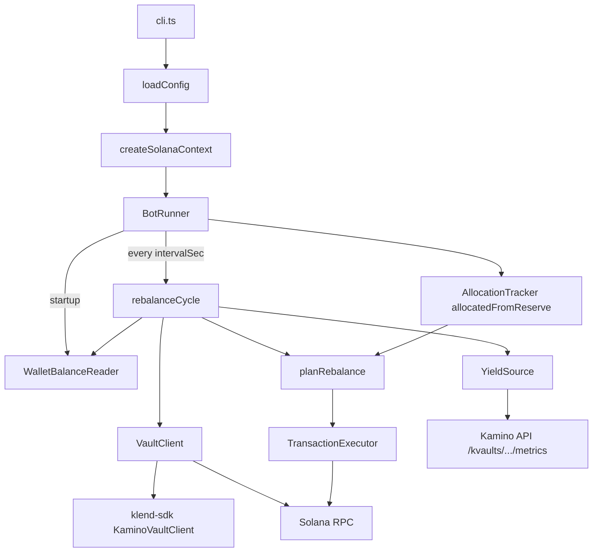

# Kamino Multi-Vault Yield Rebalance Bot

## Status

**Implemented.** The repo matches this plan; use this document as the architecture reference when extending the bot.

## Context

- **Runtime:** [Bun](https://bun.sh) with `env = true` in [`bunfig.toml`](bunfig.toml) (no `dotenv`).
- **Product:** [Kamino Earn / K-Vaults](https://kamino.com/docs) (curated lending vaults), not raw Klend reserve deposits.
- **SDK:** [`@kamino-finance/klend-sdk`](package.json) v8 — `KaminoVault`, `KaminoVaultClient`, `getUserSharesState`, `depositIxs`, `withdrawIxs`, farm stake/unstake ix bundles.
- **Constraint:** All configured vaults must share the **same underlying token mint** (USDC in examples: `EPjFWdd5AufqSSqeM2qN1xzybapC8G4wEGGkZwyTDt1v`).
- **Dependency pin:** `@kamino-finance/farms-sdk@3.2.24` via `package.json` `overrides` (klend-sdk v8 breaks on farms-sdk 3.2.25+).

## Architecture



### Module layout

| Path | Responsibility |
| --- | --- |
| [`src/cli.ts`](src/cli.ts) | Arg parsing (`--duration`, `--interval`, `--help`), wire deps, start `BotRunner` |
| [`src/index.ts`](src/index.ts) | Re-export `main()` from `cli.ts` |
| [`src/config/env.ts`](src/config/env.ts) | Parse/validate env + CLI overrides; `parsePrivateKeyBytes` (base58 or JSON array) |
| [`src/config/types.ts`](src/config/types.ts) | `BotConfig`, `RebalanceAction`, `RebalanceInput`, `AllocationTracker` |
| [`src/solana/connection.ts`](src/solana/connection.ts) | `createSolanaRpc`, subscriptions, signer from `PRIVATE_KEY` (base58 via kit codec) |
| [`src/solana/walletBalances.ts`](src/solana/walletBalances.ts) | SOL + USDC ATA balance reader (`WalletBalanceReader`) |
| [`src/kamino/yieldSource.ts`](src/kamino/yieldSource.ts) | `KaminoApiYieldSource` — `apy24h` with `apy7d` fallback |
| [`src/kamino/vaultClient.ts`](src/kamino/vaultClient.ts) | `KaminoVaultClientAdapter`: positions (ATA + farm shares), liquidity, deposit/withdraw ix bundles + vault LUT |
| [`src/kamino/txExecutor.ts`](src/kamino/txExecutor.ts) | `KitTransactionExecutor`: compute budget, one ix per tx, optional LUT compression |
| [`src/kamino/types.ts`](src/kamino/types.ts) | `BlockhashWithHeight` for tx lifetime |
| [`src/strategy/planRebalance.ts`](src/strategy/planRebalance.ts) | Pluggable `AllocationStrategy`; default `proportionalByApy` |
| [`src/bot/runner.ts`](src/bot/runner.ts) | Timer loop, startup balances, `AllocationTracker` seeding, injectable `now`/`sleep` |
| [`src/bot/rebalance.ts`](src/bot/rebalance.ts) | Single cycle: fetch → plan → dry-run log or execute |
| [`scripts/earnAndWithdraw.ts`](scripts/earnAndWithdraw.ts) | Standalone manual deposit/withdraw smoke script (not part of bot loop) |

### Injectable interfaces (testing)

- `YieldSource` — [`src/kamino/yieldSource.ts`](src/kamino/yieldSource.ts)
- `VaultClient` — [`src/kamino/vaultClient.ts`](src/kamino/vaultClient.ts)
- `TransactionExecutor` — [`src/kamino/txExecutor.ts`](src/kamino/txExecutor.ts)
- `WalletBalanceReader` — [`src/solana/walletBalances.ts`](src/solana/walletBalances.ts)

`BotRunner` accepts mocked implementations (see e2e test).

## Configuration

### `.env` / `.env.example`

| Variable | Required | Default | Purpose |
| --- | --- | --- | --- |
| `SOLANA_RPC` | yes | — | HTTP RPC URL |
| `PRIVATE_KEY` | yes | — | Base58 secret or JSON byte array (`solana-keygen`); `parsePrivateKeyBytes` in config tests; CLI signer uses base58 codec in `createSolanaContext` |
| `VAULT_ADDRESSES` | yes | — | Comma-separated **1–3** vault pubkeys (same underlying mint) |
| `MAX_ALLOCATION` | yes | — | Max **reserve principal** deployable into vaults (decimal string, e.g. `10` USDC); yield above startup baseline does not consume budget |
| `RUN_SECONDS` | no | indefinite | Total runtime **X**; CLI `--duration` overrides |
| `REBALANCE_INTERVAL_SECONDS` | no | `900` (15 min) | Cycle period **Y**; CLI `--interval` overrides |
| `DRY_RUN` | no | `true` | Plan + log only, no transactions |
| `MIN_MOVE_AMOUNT` | no | `0` | Skip moves below dust threshold |

**Example USDC vaults** (verify on [Kamino](https://app.kamino.finance) before mainnet):

- Steakhouse USDC (conservative): `HDsayqAsDWy3QvANGqh2yNraqcD8Fnjgh73Mhb3WRS5E`
- Allez USDC (balanced): `A1USdzqDHmw5oz97AkqAGLxEQZfFjASZFuy4T6Qdvnpo`
- RockawayX RWA USDC (balanced): `DWSXb18xZApz29vnQpgR2m6MynCT7PznaXt7Ut7M7KaP`

### CLI

```bash
bun run start -- --duration 300 --interval 60
bun run src/cli.ts --help
```

- CLI flags override env.
- Fail fast if vault count ∉ [1, 3] or `duration <= interval` when duration is set.

## Rebalance strategy (proportional, extensible)

[`src/strategy/planRebalance.ts`](src/strategy/planRebalance.ts):

```ts
export type AllocationStrategy = (input: RebalanceInput) => RebalancePlan;
export const proportionalByApy: AllocationStrategy = (input) => { ... };
export function planRebalance(input, strategy = proportionalByApy): RebalancePlan;
```

### Algorithm (implemented)

1. Fetch APY per vault (`yieldSource.getApys`).
2. Read positions: `shares × exchangeRate` (ATA + staked farm shares) via `VaultClient`.
3. **Target weights:** `weight_i = apy_i / sum(apy)`; equal weights if all APY ≤ 0.
4. `vaultTotal = sum(positions)`; `deployBudget = max(0, MAX_ALLOCATION - allocatedFromReserve)`; `maxNetDeposit = min(deployBudget, usdcReserve)`.
5. `target_i = (vaultTotal + maxNetDeposit) × weight_i`; `delta_i = target_i - current_i`.
6. Build actions: withdraws (`delta < 0`), then deposits (`delta > 0`), respecting `MIN_MOVE_AMOUNT`.

**Budget semantics (differs from early “per-cycle move cap” sketch):**

- `MAX_ALLOCATION` limits **new principal from wallet reserve**, not total vault position size or vault-to-vault transfer volume.
- On startup, `allocatedFromReserve = min(startupVaultTotal, MAX_ALLOCATION)`.
- After live deposits/withdraws, `allocationTracker.allocatedFromReserve` is updated in [`rebalance.ts`](src/bot/rebalance.ts).
- Vault-to-vault rebalances can occur with zero USDC reserve when net new deposit is zero.

Swap strategies by passing a different `AllocationStrategy` to `planRebalance`.

## Rebalance cycle

[`src/bot/rebalance.ts`](src/bot/rebalance.ts):

1. `preloadVaults` + parallel fetch: positions, APYs, liquidity, wallet SOL/USDC.
2. Log per-vault APY, liquidity, position, and reserve deploy budget.
3. `plan = planRebalance(...)`.
4. If no actions → log and return.
5. If `DRY_RUN` → log plan, skip execution.
6. Else for each action: `buildDepositIxs` / `buildWithdrawIxs` → `txExecutor.sendInstructions` (withdraws first in plan order).
7. Deposit ix bundles include optional farm stake ixs; withdraw bundles include unstake + post-withdraw ixs (`farmState: null` passed to SDK for planner args; adapter still emits farm ixs when vault has farms).

## Transaction execution

[`src/kamino/txExecutor.ts`](src/kamino/txExecutor.ts):

- `@solana/kit` pipeline: fee payer → blockhash → compute budget (`DEFAULT_CU_PER_TX` from klend-sdk) → append ix → compress with vault LUT if present → sign → `sendAndConfirmTransactionFactory`.
- **One Solana transaction per instruction** in the bundle (simpler debugging; complex withdraws may expand to many ixs).
- Vault LUT from `vaultState.vaultLookupTable` when not `DEFAULT_PUBLIC_KEY`.
- Logs signature per step; updates `allocationTracker` on successful live deposit/withdraw.

## Package scripts

[`package.json`](package.json):

```json
{
  "scripts": {
    "start": "bun run src/cli.ts",
    "test": "bun run test:unit && bun run test:integration",
    "test:unit": "bun test tests/unit",
    "test:integration": "bun test tests/integration",
    "test:e2e": "bun test tests/e2e",
    "check": "bunx --bun @biomejs/biome check",
    "format": "bunx --bun @biomejs/biome check --write"
  }
}
```

Note: default `bun run test` does **not** include e2e; run `bun run test:e2e` explicitly.

## Tests (bun:test)

### Unit — [`tests/unit/`](tests/unit/)

| File | Covers |
| --- | --- |
| `config.test.ts` | Env parsing, 1–3 vaults, `duration > interval`, CLI overrides, `parsePrivateKeyBytes` |
| `planRebalance.test.ts` | Proportional weights, reserve budget, cold start, balanced no-op, vault-to-vault without reserve, withdraw-before-deposit order |
| `runner.test.ts` | Fake clock: expected cycle count (`floor(duration/interval)`) |
| `walletBalances.test.ts` | USDC ATA derivation; optional live RPC balance read |

No network required for config/plan/runner logic tests.

### Integration — [`tests/integration/`](tests/integration/)

| File | Covers |
| --- | --- |
| `kaminoApi.test.ts` | Live `GET /kvaults/vaults/{addr}/metrics`; numeric APY |
| `vaultClient.test.ts` | Read-only RPC: vault state + user shares; skip if `SOLANA_RPC` unset |

Use `describe.skipIf(!process.env.SOLANA_RPC)` (or equivalent) so CI without RPC passes.

### E2E — [`tests/e2e/`](tests/e2e/)

| File | Covers |
| --- | --- |
| `botDryRun.test.ts` | In-process `BotRunner`: `DRY_RUN=true`, X=5, Y=2 → ≥2 cycles, plan logged, no chain writes |

`botLive.test.ts` was planned but **not implemented**; optional live e2e remains out of CI.

## CI

[`.github/workflows/ci.yaml`](.github/workflows/ci.yaml): `bun install` → `bun run check` (Biome) → `bun run test` (unit + integration). Optional `SOLANA_RPC` / `PRIVATE_KEY` from GitHub secrets for integration.

## Documentation

- [`README.md`](README.md) — overview, env table, rebalance semantics, test commands, safety, Kamino SDK caveats (min amounts, tx size, compute units).
- [`.env.example`](.env.example) — no secrets; example vaults and defaults.

## Out of scope (v1)

- Cross-mint vaults.
- Curator `syncAllocations` (admin-only); bot is a **depositor** moving between earn vaults.
- Optional `botLive.test.ts` / `E2E_LIVE` harness.
- Batching multiple actions into a single transaction.

## Operational notes (from README)

- Minimum deposit/withdraw amounts vary by vault (0.1 / 1 / 10 USDC).
- Some vaults need address lookup tables or high compute limits; executor sets compute budget from klend-sdk defaults.
- Wallet must hold the vault underlying token (USDC) for new deposits; wrong mint → no deposits.

## Implementation history (completed)

1. Config + CLI + `BotRunner` (timers, indefinite mode, validation).
2. `planRebalance` + reserve budget model + unit tests.
3. Kamino API yield source + integration tests.
4. Vault client adapter + tx executor + dry-run cycle.
5. Live execution behind `DRY_RUN=false` with `allocationTracker` updates.
6. E2E dry-run, README, `.env.example`, Biome + GitHub Actions.
