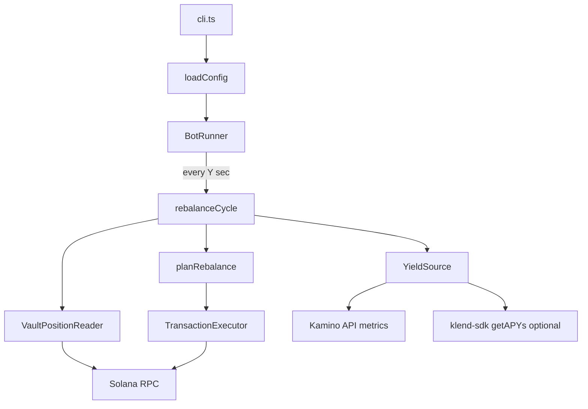

# Kamino 3-Vault Yield Rebalance Bot

## Context

- Greenfield repo: only `[src/index.ts](src/index.ts)` (`console.log` stub), deps already include `[@kamino-finance/klend-sdk](package.json)`, `@solana/kit`, `@solana/spl-token`.
- Bun auto-loads `.env` (no `dotenv`).
- Target product: **Kamino Earn / K-Vaults** (curated lending vaults), not raw Klend reserve deposits. SDK surface: `KaminoVault`, `getAPYs()`, `getUserShares()`, `depositIxs()`, `withdrawIxs()` in `[node_modules/@kamino-finance/klend-sdk/src/classes/vault.ts](node_modules/@kamino-finance/klend-sdk/src/classes/vault.ts)`.
- All 3 vaults must share the **same underlying token mint** (default: USDC `EPjFWdd5AufqSSqeM2qN1xzybapC8G4wEGGkZwyTDt1v`) so withdraw → deposit is valid.

## Architecture




### Module layout


| Path                                                             | Responsibility                                                                              |
| ---------------------------------------------------------------- | ------------------------------------------------------------------------------------------- |
| `[src/config/env.ts](src/config/env.ts)`                         | Parse/validate env + CLI overrides                                                          |
| `[src/config/types.ts](src/config/types.ts)`                     | `BotConfig`, `VaultId`, `RebalanceAction`                                                   |
| `[src/solana/connection.ts](src/solana/connection.ts)`           | `createSolanaRpc`, signer from `PRIVATE_KEY`                                                |
| `[src/kamino/yieldSource.ts](src/kamino/yieldSource.ts)`         | Fetch APY per vault (API primary; SDK adapter optional later)                               |
| `[src/kamino/vaultClient.ts](src/kamino/vaultClient.ts)`         | Load `KaminoVault`, reserves map, user shares, build deposit/withdraw ixs                   |
| `[src/kamino/txExecutor.ts](src/kamino/txExecutor.ts)`           | Compile/sign/send via `@solana/kit` (pattern from klend-sdk `sendAndConfirmTx`)             |
| `[src/strategy/planRebalance.ts](src/strategy/planRebalance.ts)` | **Pluggable allocator** (user choice: proportional)                                         |
| `[src/bot/runner.ts](src/bot/runner.ts)`                         | Timer loop: run `durationSec`, interval `intervalSec`, validate `durationSec > intervalSec` |
| `[src/cli.ts](src/cli.ts)`                                       | Arg parsing                                                                                 |
| `[src/index.ts](src/index.ts)`                                   | Entry: load config → start runner                                                           |


## Configuration

### `.env` / `.env.example`


| Variable                     | Required              | Purpose                                                                                      |
| ---------------------------- | --------------------- | -------------------------------------------------------------------------------------------- |
| `SOLANA_RPC`                 | yes                   | HTTP RPC URL                                                                                 |
| `PRIVATE_KEY`                | yes                   | Base58 secret **or** JSON byte array (solana-keygen format)                                  |
| `VAULT_ADDRESSES`            | yes                   | Comma-separated **exactly 3** vault pubkeys                                                  |
| `MAX_ALLOCATION`             | yes                   | Max underlying token units to move **per rebalance cycle** (decimal string, e.g. `100` USDC) |
| `RUN_SECONDS`                | no (CLI `--duration`) | Total bot runtime **X. If not specified, the bot runs indefinitely.**                        |
| `REBALANCE_INTERVAL_SECONDS` | no (CLI `--interval`) | Cycle period **Y. If not specified, the bot rebalance cyle is every 15 minutes.**            |
| `DRY_RUN`                    | no                    | `true` = plan + log, no transactions (default `true` in tests)                               |
| `MIN_MOVE_AMOUNT`            | no                    | Skip moves below dust threshold                                                              |


**Default vault examples** (same USDC mint; high APY at time of planning—document as examples only in `.env.example`):

- Steakhouse USDC (conservative): `HDsayqAsDWy3QvANGqh2yNraqcD8Fnjgh73Mhb3WRS5E`
- Allez USDC (balanced):
`A1USdzqDHmw5oz97AkqAGLxEQZfFjASZFuy4T6Qdvnpo`
- RockawayX RWA USDC (balanced):
`DWSXb18xZApz29vnQpgR2m6MynCT7PznaXt7Ut7M7KaP`

### CLI

```bash
bun run src/cli.ts --duration 300 --interval 60
```

- CLI flags override env.
- Fail fast if `duration <= interval` or vault count ≠ 3.

## Rebalance strategy (proportional, extensible)

Implement in `[src/strategy/planRebalance.ts](src/strategy/planRebalance.ts)`:

```ts
export type AllocationStrategy = (
  input: RebalanceInput,
) => RebalancePlan;

export const proportionalByApy: AllocationStrategy = (input) => { ... };
```

**Algorithm (v1):**

1. Fetch APY for each vault (`yieldSource.getApy(vault)`).
2. Read user position value per vault: `shares * exchangeRate` via SDK.
3. Compute **target weights**: `weight_i = apy_i / sum(apy)` (if all zero APY → equal weights).
4. `totalValue = sum(positions)`; `target_i = totalValue * weight_i`.
5. `delta_i = target_i - current_i`; withdraw vaults with `delta < 0`, deposit vaults with `delta > 0`.
6. Scale total outflow/inflow so **sum of absolute moves ≤ MAX_ALLOCATION** (pro-rata if needed).
7. Return ordered actions: withdraws first, then deposits (same token).

Export `planRebalance(input, strategy = proportionalByApy)` so future strategies (greedy, min-APY-gap) are one-line swaps.

## Rebalance cycle

`[src/bot/rebalance.ts](src/bot/rebalance.ts)`:

1. Load APYs + positions.
2. `plan = planRebalance(...)`.
3. If `DRY_RUN`, log plan and return.
4. Else for each withdraw: `vault.withdrawIxs(...)` → send tx; for each deposit: `vault.depositIxs(...)` → send tx.
5. Use shared `KaminoVaultClient`, preload `loadVaultReserves` once per vault per cycle.
6. Handle farm staking: pass `farmState: null, flcFarmState: null` initially (no farm stake) to keep v1 simple; document extension point.

## Transaction execution

- Reuse `@solana/kit` pipeline: `createTransactionMessage` → append ixs → fee payer → blockhash → sign → `sendAndConfirmTransactionFactory`.
- Extract minimal helper from klend-sdk’s `[client/tx/tx.ts](node_modules/@kamino-finance/klend-sdk/src/client/tx/tx.ts)` logic (no need to import private CLI modules).
- Log signatures + errors; one action per transaction in v1 (simpler debugging).

## Package scripts

Update `[package.json](package.json)`:

```json
{
  "scripts": {
    "start": "bun run src/cli.ts",
    "test": "bun test",
    "test:unit": "bun test tests/unit",
    "test:integration": "bun test tests/integration",
    "test:e2e": "bun test tests/e2e"
  }
}
```

## Tests (bun:test)

### Unit — `[tests/unit/](tests/unit/)`


| File                    | Covers                                                                                  |
| ----------------------- | --------------------------------------------------------------------------------------- |
| `config.test.ts`        | Env parsing, `PRIVATE_KEY` formats, `duration > interval`, 3 vaults                     |
| `planRebalance.test.ts` | Proportional math, `MAX_ALLOCATION` cap, zero-APY fallback, no-op when already balanced |
| `runner.test.ts`        | Fake clock: X=10, Y=3 → exactly 3 cycles (floor), then stop                             |


No network.

### Integration — `[tests/integration/](tests/integration/)`


| File                  | Covers                                                                                                                                                     |
| --------------------- | ---------------------------------------------------------------------------------------------------------------------------------------------------------- |
| `kaminoApi.test.ts`   | Live `GET /kvaults/vaults/{addr}/metrics` for configured/example vaults; assert numeric APY                                                                |
| `vaultClient.test.ts` | Read-only RPC: load vault state + user shares for a known pubkey (use `11111111111111111111111111111111` or env `TEST_WALLET`); skip if `SOLANA_RPC` unset |


Mark with `describe.skipIf(!process.env.SOLANA_RPC)` so CI without RPC passes.

### E2E — `[tests/e2e/](tests/e2e/)`


| File                | Covers                                                                                                           |
| ------------------- | ---------------------------------------------------------------------------------------------------------------- |
| `botDryRun.test.ts` | Spawn/in-process runner: `DRY_RUN=true`, X=5, Y=2 → ≥2 cycles, logs contain planned actions; **no chain writes** |
| `botLive.test.ts`   | `describe.skipIf(!process.env.E2E_LIVE)` — optional real run with funded wallet; not required for CI             |


Use injectable `YieldSource` + `VaultClient` interfaces in runner for test doubles.

## Documentation

- Expand `[README.md](README.md)`: env table, CLI example, test commands, safety warnings (mainnet funds, start with `DRY_RUN=true`).
- Add `[.env.example](.env.example)` (no secrets).

## Out of scope (v1)

- LUT optimization / multi-tx batching (SDK may require multiple txs for complex withdraws—log and send sequentially).
- Cross-mint vaults.
- Curator `syncAllocations` (admin-only); this bot is a **depositor** moving between 3 earn vaults.

## Implementation order

1. Config + CLI + runner skeleton (timers only, mock cycle).
2. `planRebalance` + unit tests.
3. Kamino API yield source + integration test.
4. Vault client + tx executor + dry-run cycle.
5. Wire live execution behind `DRY_RUN=false`.
6. E2E dry-run test + README / `.env.example`.

