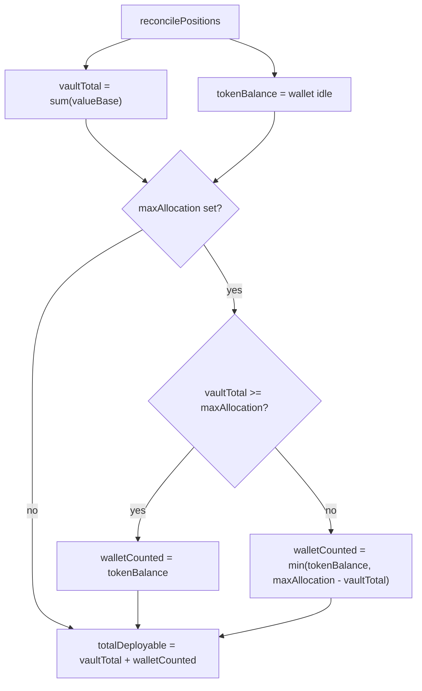
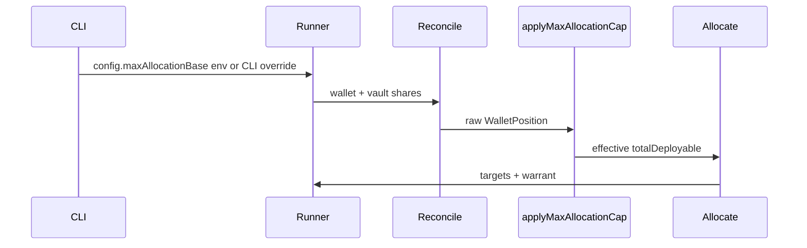

# MAX_ALLOCATION deployable cap

## Semantics (core rule)

`MAX_ALLOCATION` limits **new/input** wallet liquidity counted toward allocation—not vault principal after it is deployed. Vault share value (`valueBase`) is always included in full.




| Scenario (base units, max = 100M)           | vaultTotal | tokenBalance | totalDeployable                             |
| ------------------------------------------- | ---------- | ------------ | ------------------------------------------- |
| Initial deploy ($90 in vaults, $10 reserve) | 90M        | 10M          | **100M**                                    |
| Yield growth ($120 vaults, $10 reserve)     | 120M       | 10M          | **130M** (vault above cap → no wallet clip) |
| Excess idle USDC ($90 vaults, $50 wallet)   | 90M        | 50M          | **100M** (only 10M wallet counted)          |
| Unset `MAX_ALLOCATION`                      | any        | any          | vaultTotal + tokenBalance                   |


This matches your example: rebalance planning uses **$120 + $10** after growth, not a hard $100 portfolio ceiling.

**Units:** token base units (same as `MIN_TRADE_SIZE_BASE`). README will document e.g. `100000000` = 100 USDC (6 decimals).

---

## Implementation

### 1. Pure cap helper + `WalletPosition` audit fields

Add `[src/strategy/deployable.ts](src/strategy/deployable.ts)`:

- `computeEffectiveDeployable(vaultTotal, tokenBalance, maxAllocationBase?: bigint): bigint`
- `applyMaxAllocationCap(position: WalletPosition, maxAllocationBase?: bigint): WalletPosition`

Extend `[src/kamino/reconcile.ts](src/kamino/reconcile.ts)` `WalletPosition`:

```typescript
totalOnChain: bigint;        // vaultTotal + raw tokenBalance (audit)
walletBalanceCounted: bigint; // portion of tokenBalance used in strategy
totalDeployable: bigint;      // effective amount for allocation (capped)
```

After reconcile, `applyMaxAllocationCap` sets `totalDeployable` / `walletBalanceCounted` / `totalOnChain`. Raw `tokenBalance` stays unchanged for on-chain truth.

Update `[src/cycle/runner.ts](src/cycle/runner.ts)` (~line 312): after `reconcile(...)`, call `applyMaxAllocationCap(position, config.maxAllocationBase)`.

Update `serializePosition` in runner to stringify new fields for decision logs.

`currentAllocationsFromPosition` already divides by `position.totalDeployable`—no change needed once `totalDeployable` is the effective value.

Allocation (`[src/strategy/allocate.ts](src/strategy/allocate.ts)`) and warrant (`[src/strategy/warrant.ts](src/strategy/warrant.ts)`) keep taking `position.totalDeployable`; no API change.

### 2. Config: env + schema

`[src/config/schema.ts](src/config/schema.ts)` — add optional field on `operatorConfigSchema`:

```typescript
maxAllocationBase: z.union([z.string().regex(/^[0-9]+$/), z.bigint()]).transform(...).optional()
```

`[src/config/load.ts](src/config/load.ts)` — parse `MAX_ALLOCATION` from env (omit when unset).

`[specs/001-vault-yield-rebalance/contracts/config.schema.json](specs/001-vault-yield-rebalance/contracts/config.schema.json)` — mirror optional `maxAllocationBase`.

`[.env.example](.env.example)` — commented example:

```bash
# Optional cap on counted wallet input (base units; 10 USDC = 10000000)
# MAX_ALLOCATION=10000000
```

### 3. CLI one-cycle override

Extend `[src/cli/parse-args.ts](src/cli/parse-args.ts)`:

- `CycleCommandOptions { maxAllocationBase?: bigint }`
- `parseCycleCommandOptions(argv)` — flags `--max-allocation=<n>` (and alias `-m`)

`[src/cli.ts](src/cli.ts)`:

- `runOneCycle(restArgv)` — parse cycle options, load config, **CLI overrides env** when flag present
- Update `printUsage()` for cycle command

Example:

```bash
bun run src/cli.ts cycle --max-allocation=100000000
PREVIEW_MODE=true bun run cli cycle  # uses .env MAX_ALLOCATION if set
```

Daemon `run` / `[src/index.ts](src/index.ts)` use env only (no CLI flag requested).

Helper to merge override:

```typescript
function withMaxAllocationOverride(config: OperatorConfig, override?: bigint): OperatorConfig
```

### 4. Tests

New `[tests/unit/deployable-cap.test.ts](tests/unit/deployable-cap.test.ts)`:

- All four table scenarios above
- Unset cap passthrough
- Edge: `vaultTotal === maxAllocation`, `vaultTotal > maxAllocation`, zero wallet

Update `[tests/unit/config.test.ts](tests/unit/config.test.ts)`:

- Load `MAX_ALLOCATION` from env
- Invalid non-numeric rejected

New `[tests/unit/cli-parse-args.test.ts](tests/unit/cli-parse-args.test.ts)` or extend existing:

- `parseCycleCommandOptions` parses flag and rejects invalid values

Extend one cycle test (e.g. `[tests/unit/cycle-preview.test.ts](tests/unit/cycle-preview.test.ts)`) with mocked reconcile + cap: decision log `inputs.position` shows `totalOnChain` vs `totalDeployable`.

Run: `bun test tests/unit/deployable-cap.test.ts` (and affected suites).

### 5. README

`[README.md](README.md)`:

- Add `MAX_ALLOCATION` row to env table with semantics (input cap, yield not clipped)
- Document CLI override for `cycle`
- Short example tying $10 → `10000000` base units

Optional one-line note in `[specs/001-vault-yield-rebalance/data-model.md](specs/001-vault-yield-rebalance/data-model.md)` under `WalletPosition` for spec parity (light touch).

---

## Out of scope (unchanged)

- Implementing `resolveWalletTokenBalanceBase` (wallet still defaults to `0n` in reconcile); cap logic is ready once wallet balance is wired.
- `MAX_ALLOCATION` on `run` / backtest commands.
- Capping individual deposit tx amounts in `execute.ts` (planning cap is sufficient; legs are deltas vs on-chain positions).

## Data flow (after change)




