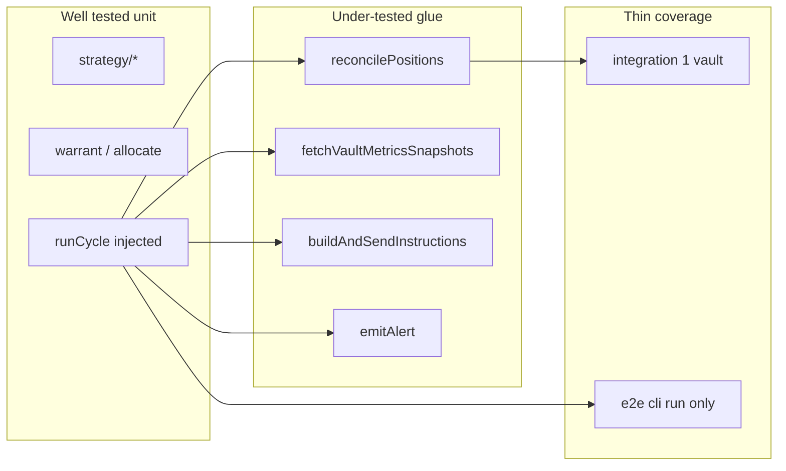

# Integration and E2E Test Hardening Plan

## Current state

| Layer | Files | Gating | What it covers |
|-------|-------|--------|----------------|
| Unit | 16 files, **82 tests** | Always (`bun test`) | Strategy, config, `runCycle` with injected `reconcile` / `fetchMetrics` / `executeActions`, holds, preview, partial tx failure |
| Integration | 3 files, **4 tests** | `RUN_INTEGRATION_TESTS=true` | RPC load, single-vault metrics/summary, deposit/withdraw **ix build** (no send) |
| E2E | 1 file, **1 test** | `RUN_E2E_TESTS=true` | [`tests/e2e/trading-bot-run.test.ts`](tests/e2e/trading-bot-run.test.ts): `cli run 30 10` preview subprocess only |

[`runner.ts`](src/cycle/runner.ts) already supports dependency injection (`reconcile`, `fetchMetrics`, `executeActions`) — unit tests use this well. [`reconcilePositions`](src/kamino/reconcile.ts), [`chain/tx.ts`](src/chain/tx.ts), and [`alerts/emit.ts`](src/alerts/emit.ts) have **no direct tests**.

CI ([`.github/workflows/ci.yaml`](.github/workflows/ci.yaml)) runs `bun run test` + `bun run test:integration` with secrets; **e2e is not in CI**.

## Where tests are lacking (by risk)

1. **On-chain read path (`reconcilePositions`)** — Parses SDK `getUserShares` / `getExchangeRate` shapes into `valueBase`. Bugs here mis-size every rebalance. No unit tests; integration only touches one vault via `fetchVaultSummary`, not `reconcilePositions`.

2. **`runCycle` guard branches** — Stale metrics and execution holds are covered; **APY spike → `dependency_hold`** ([`runner.ts` L379–396](src/cycle/runner.ts)) is not exercised end-to-end in `runCycle` (only low-level helpers in [`metrics-apy-spike.test.ts`](tests/unit/metrics-apy-spike.test.ts)). Reconcile **throw → dependency hold** is untested.

3. **Transaction send / retry** — [`execute.test.ts`](tests/unit/execute.test.ts) mocks failure; [`buildAndSendInstructions`](src/chain/tx.ts) retry/backoff is untested.

4. **Alerts** — Webhook + stdout events (`dependency_hold_entered`, `tx_leg_failed`, etc.) are untested; regressions would be silent in ops.

5. **CLI + DB wiring** — [`cli.ts`](src/cli.ts) wires migrate → `runCycle` / `ack-hold` / `backtest` / daemon; only [`cli-parse-args.test.ts`](tests/unit/cli-parse-args.test.ts) is tested. E2e never runs `cli cycle` or asserts SQLite rows.

6. **Integration scope** — Production uses **three** vaults from `VAULTS`; integration mostly hits `EXAMPLE_VAULT_ADDRESSES.allezUsdc` only. `fetchVaultMetricsSnapshots` for the full triplet is unverified against live RPC.

7. **E2E** — 30s `cli run` smoke is valuable but slow and narrow; not in CI.

**Intentionally out of scope (low ROI / high cost):** broadcasting real mainnet rebalances in CI. [`deposit-ix-build.test.ts`](tests/integration/deposit-ix-build.test.ts) is the right on-chain boundary.

---

## Recommended tests to add

### Phase 1 — Fast unit glue (highest ROI, no RPC)

| New file | Tests | Why it hardens |
|----------|-------|----------------|
| `tests/unit/reconcile.test.ts` | Mock `createVaultReader` + `resolveWalletTokenBalanceBase`: `{ totalShares }` object vs raw bigint, Decimal exchange rate, multi-vault sum, zero shares | Catches parsing regressions before any cycle runs |
| `tests/unit/cycle-apy-spike.test.ts` | `runCycle` with `fetchMetrics` returning snapshots where `validForTrading: false` (or use real `fetchVaultMetricsSnapshots` path via pre-seeded APY history + spike snapshot) → `dependency_hold`, `reason: apy_spike` | Closes gap between metrics helpers and runner |
| `tests/unit/cycle-reconcile-error.test.ts` | `reconcile` throws timeout-like error → `dependency_hold`, `alertEvent: rpc_timeout` | Exercises [`returnDependencyHold`](src/cycle/runner.ts) reconcile phase |
| `tests/unit/cycle-live-success.test.ts` | `previewMode: false`, mock `executeActions` all `confirmed` → `completed`, `writeRebalanceActions` persisted | Complements existing partial-failure test in [`cycle-timeout.test.ts`](tests/unit/cycle-timeout.test.ts) |
| `tests/unit/alerts-emit.test.ts` | Capture stdout JSON; mock `globalThis.fetch` for webhook success/failure (must not throw) | FR-015 operational safety |
| `tests/unit/tx-retry.test.ts` | Inject failing then succeeding send (extract or mock internal send path) → `attempts === 2` | Protects leg retry policy tied to `LEG_MAX_ATTEMPTS` |

**Harness improvement:** add [`tests/helpers/cycle-fixtures.ts`](tests/helpers/cycle-fixtures.ts) — shared `baseConfig`, `freshSnapshots()`, minimal `CycleContext` builder to reduce duplication across 6+ cycle test files.

### Phase 2 — Integration expansion (RPC, still no tx send)

| New / extended file | Tests |
|---------------------|-------|
| `tests/integration/vault-triplet-metrics.test.ts` | `fetchVaultMetricsSnapshots` for all three `EXAMPLE_VAULT_ADDRESSES` / env `VAULTS`; assert 3 snapshots, all `fresh`, `tvlUsd > 0` |
| `tests/integration/reconcile-position.test.ts` | `reconcilePositions` with real RPC + `INTEGRATION_USER_ADDRESS` + configured vault list; assert `totalOnChain`, per-vault `vaultShares`, numeric consistency |
| Extend `deposit-ix-build.test.ts` | Optional: build ix for **second** vault address to catch vault-specific SDK differences |

Env: document in README that integration needs `SOLANA_RPC`, `INTEGRATION_USER_ADDRESS`, `PRIVATE_KEY` (ix build only).

### Phase 3 — E2E subprocess + DB assertions

| New file | Tests |
|----------|-------|
| `tests/e2e/cli-cycle.test.ts` | Spawn `bun run src/cli.ts cycle` with temp `DATABASE_URL`, `PREVIEW_MODE=true`, copy minimal env; parse stdout JSON; query SQLite for `cycles` + `decision_logs` row |
| `tests/e2e/cli-ack-hold.test.ts` | Seed execution hold via in-process `enterExecutionHold` + same DB path, or run failing live cycle in preview-off dev setup; then `cli ack-hold` exits 0 |
| Refine `trading-bot-run.test.ts` | Add optional **fast** profile: `run 12 4` behind env `E2E_FAST=true` for quicker local/CI runs; keep 30/10 as default local soak |

**E2E DB helper:** `tests/helpers/assert-db-cycle.ts` — given `dbPath` + `cycleId`, assert cycle status and decision log `outcome`.

### Phase 4 — CI and scripts

- Add job step (or separate job): `RUN_E2E_TESTS=true bun test tests/e2e` with `E2E_FAST=true`, temp dir, no secrets beyond what unit/integration already need.
- Add root script: `"test:all": "bun test tests/unit && RUN_INTEGRATION_TESTS=true bun test tests/integration --timeout 10000"` (e2e optional documented).
- Consider splitting CI integration job to **scheduled** or `continue-on-error` if free RPC flakiness blocks PRs (observed risk with `GetProgramAccounts`-heavy calls per README).

---

## Priority order (if implementing incrementally)

1. `reconcile.test.ts` + `cycle-apy-spike.test.ts` + `cycle-reconcile-error.test.ts`
2. `alerts-emit.test.ts` + `tx-retry.test.ts`
3. Integration triplet + `reconcile-position.test.ts`
4. E2E `cli-cycle` + DB assertions + CI e2e fast mode
5. `cycle-fixtures.ts` refactor (can ride along with new tests)

---

## What not to add (unless you explicitly want it)

- Mainnet rebalance e2e with real funds
- Duplicating strategy math already covered in [`allocate.test.ts`](tests/unit/allocate.test.ts) / [`warrant.test.ts`](tests/unit/warrant.test.ts)
- Browser/UI tests (CLI-only bot)

## Success criteria

- Unit count grows modestly (~15–25 tests) focused on glue, not strategy duplication
- Every `runCycle` early-exit reason (`stale_metrics`, `apy_spike`, reconcile/metrics errors, `execution_hold`) has at least one test
- Integration validates **3-vault** config shape used in production
- E2E covers **`cli cycle`** + DB persistence; CI runs a fast e2e variant
- `bun run test` remains the default fast path (&lt;2s today)
