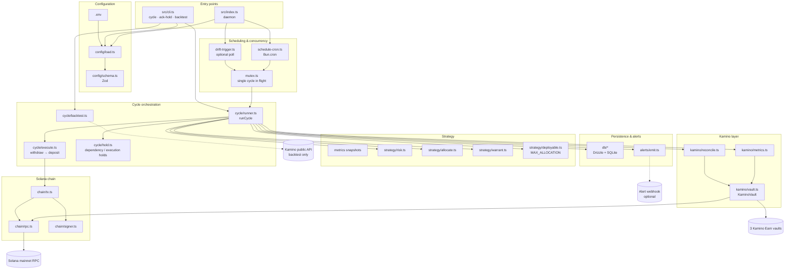

# Kamino Vault Yield Rebalancer

Automated TypeScript bot that reallocates capital across three [Kamino Earn](https://kamino.finance) vaults using risk-adjusted scoring, guardrails, preview mode, and operational holds. Built with [Bun](https://bun.com), `[@kamino-finance/klend-sdk](https://github.com/Kamino-Finance/klend-sdk)`, and `[@solana/kit](https://github.com/anza-xyz/kit)`.

## Features

- Scores three vaults on risk-adjusted yield and computes target allocations.
- Rebalances via withdraw-then-deposit batches through a single operator wallet.
- Defaults to **preview mode** (no on-chain transactions) until you explicitly enable live execution.
- Persists every cycle decision, metrics snapshot, and hold state in SQLite.
- Schedules evaluation on `Bun.cron` with optional drift-triggered extra cycles.
- Pauses after repeated transaction failures until an operator acknowledges the hold.

> [!IMPORTANT]
> This bot sends real mainnet transactions when `PREVIEW_MODE=false`. Run several preview cycles and validate decisions before going live.

## Architecture




**Cycle flow (one tick):** load config → check holds → fetch metrics → reconcile wallet/vault positions → score and target allocations → warrant (skip if churn not worth it) → plan legs → execute or preview → log to SQLite and optional webhook.

## Prerequisites

- [Bun](https://bun.com) ≥ 1.3
- Solana mainnet RPC URL
- Wallet private key (base58) funded with the vault deposit asset
- Three Kamino Earn vault addresses

## Environment

Copy and edit `.env` from `.env.example` (never commit `.env`):

```bash
cp .env.example .env
```

Config the following env:
- `PRIVATE_KEY` - your Solana wallet where capital is deployed from.
- `SOLANA_RPC` - Performant RPC endpoint that support calling Solana API `GetProgramAccounts()`.

Key variables:


| Variable                              | Description                                                                                                                                                                                          |
| ------------------------------------- | ---------------------------------------------------------------------------------------------------------------------------------------------------------------------------------------------------- |
| `SOLANA_RPC`                          | Mainnet RPC endpoint. Use paid Alchemy or Helius RPC that support calling `[GetProgramAccounts()](https://solana.com/docs/rpc/http/getprogramaccounts)`                                              |
| `PRIVATE_KEY`                         | Base58 signing key from which the fund will disperse from                                                                                                                                            |
| `VAULTS`                              | Three comma-separated vault addresses                                                                                                                                                                |
| `MAX_ALLOCATION`                      | Optional cap on **counted wallet input** (token base units, e.g. `10000000` = 10 USDC with 6 decimals). Vault principal is always fully counted; yield above the cap is not clipped. Unset = no cap. |
| `PREVIEW_MODE`                        | `true` (default) = no on-chain txs; set `false` explicitly for live                                                                                                                                  |
| `CRON_EXPRESSION`                     | `Bun.cron` schedule (default to run every 15 mins)                                                                                                                                                   |
| `DRIFT_TRIGGER_ENABLED`               | Optional extra cycles when drift exceeds `driftBandPct`                                                                                                                                              |
| `RISK_PROFILE`                        | `conservative` | `balanced` | `aggressive`                                                                                                                                                           |
| `METRICS_MAX_AGE_MS`                  | Stale metrics cutoff (default 15 min)                                                                                                                                                                |
| `APY_SPIKE_GUARD_MULTIPLE`            | Skip trading when APY > N× trailing average (default 3)                                                                                                                                              |
| `RPC_TIMEOUT_MS` / `CYCLE_TIMEOUT_MS` | Per-call and per-cycle limits                                                                                                                                                                        |
| `DATABASE_URL`                        | SQLite path (default `./data/bot.sqlite`)                                                                                                                                                            |
| `ALERT_WEBHOOK_URL`                   | Optional JSON alert webhook                                                                                                                                                                          |


See [specs/001-vault-yield-rebalance/quickstart.md](specs/001-vault-yield-rebalance/quickstart.md) for the full operator flow.

## Install & database

```bash
bun install
bun run db:migrate
```

## Scripts


| Command                    | Description                                                                                    |
| -------------------------- | ---------------------------------------------------------------------------------------------- |
| `bun run start`            | Cron daemon + optional drift trigger (`src/index.ts`)                                          |
| `bun run cli cycle`        | One rebalance cycle (preview or live per `PREVIEW_MODE`); optional `--max-allocation` override |
| `bun run cli ack-hold`     | Acknowledge execution hold after repeated tx failures                                          |
| `bun run cli backtest`     | Historical policy replay (no on-chain txs)                                                     |
| `bun run db:migrate`       | Apply SQLite migrations                                                                        |
| `bun run db:generate`      | Generate Drizzle migrations                                                                    |
| `bun test`                 | Unit tests                                                                                     |
| `bun run test:integration` | Integration tests (requires RPC + vaults)                                                      |
| `bun run test:e2e`         | Full process smoke test (~15s, gated)                                                          |
| `bun run test:e2e:slow`         | Full process smoke test (~30s, gated)                                                          |
| `bun run compile`          | Typecheck (`tsc --noEmit`)                                                                     |
| `bun run check`            | Biome lint/format check                                                                        |
| `bun run format`           | Biome auto-fix                                                                                 |


## First preview cycle

```bash
PREVIEW_MODE=true bun run cli cycle
```

Override the deployable cap for a single run (token base units; overrides `MAX_ALLOCATION` from `.env`):

```bash
PREVIEW_MODE=true bun run src/cli.ts cycle --max-allocation=10000000
```

Expected: decision log with scores, targets, and planned legs; `status: preview` or `skipped` — no deposits or withdrawals. When capped, `inputs.position` includes `totalOnChain` (raw) and `totalDeployable` (effective).

### MAX_ALLOCATION behavior

- Caps how much **idle wallet balance** is counted toward allocation, not vault value after deployment.
- Example with `MAX_ALLOCATION=100000000` (100 USDC): $90 in vaults + $10 reserve → deployable **100M** base units; after yield grows to $120 in vaults + $10 reserve → deployable **130M** (vault growth is never clipped).

## Live rebalancing

1. Run several preview cycles and confirm skip/trade decisions look correct.
2. Set `PREVIEW_MODE=false` explicitly (loader defaults to `true` when unset).
3. Start the daemon:

```bash
bun run start
```

`Bun.cron` runs one cycle per tick with overlap protection. With `DRIFT_TRIGGER_ENABLED=true`, a drift poll can trigger additional cycles when allocation drift exceeds `policy.driftBandPct`.

## Clear execution hold

After three consecutive cycles with failed transactions:

```bash
bun run cli ack-hold
```

> [!TIP]
> Dependency holds (stale metrics, RPC timeouts) clear automatically when checks pass. Execution holds after repeated tx failures require `ack-hold`.

## Testing

```bash
# Check syntax and formatting
bun run check
# Typecheck
bun run compile
# Unit test
bun test
# Integration test
bun test:integration
# End-to-end test, take ~15s
bun test:e2e
```

Integration and e2e tests require `RUN_INTEGRATION_TESTS=true` / `RUN_E2E_TESTS=true` and a configured RPC (see `.env.example`).

## Dependency versions

Solana stack is pinned to a single Kit tree:

```bash
bun pm ls | grep @solana/kit
```

Expect `@solana/kit@2.3.x` aligned with `@kamino-finance/klend-sdk` (see `package.json` overrides). Do not add `@solana/web3.js` 1.x.

## Project layout

```text
src/
├── index.ts           # Daemon entry (cron + drift trigger)
├── cli.ts             # cycle | ack-hold | backtest | daemon
├── config/
│   ├── schema.ts      # Zod operator config
│   └── load.ts        # Env → config
├── chain/             # RPC, signer, tx send/confirm
├── kamino/            # Vault reads, metrics, reconcile
├── strategy/          # Risk, allocation, warrant, deployable cap
├── cycle/             # runCycle, execute, holds, backtest
├── db/                # Drizzle SQLite
└── alerts/            # Structured alerts + webhook

tests/
├── unit/
├── integration/
└── e2e/

specs/001-vault-yield-rebalance/   # Feature spec, plan, quickstart
```

## Spec Kit

Feature design lives under `specs/001-vault-yield-rebalance/`. Governance: `[.specify/memory/constitution.md](.specify/memory/constitution.md)`.

## Security

- Do not commit `.env`, private keys, or `data/bot.sqlite`.
- Default to preview mode; enable live only after validating decisions.
- Integration and daemon runs use real mainnet RPC.

