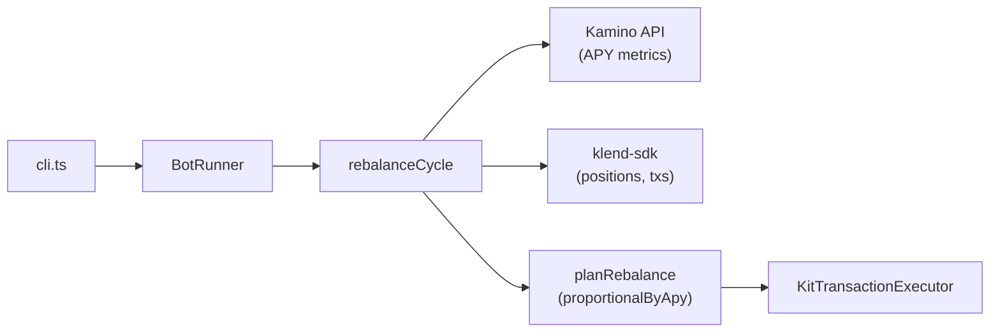

# Kamino Multi-Vault Yield Rebalance Bot

[](https://bun.sh)
[](https://www.typescriptlang.org)
[](https://solana.com)

A [Bun](https://bun.sh) / TypeScript CLI that reallocates deposits across **1–3** [Kamino Earn (K-Vault)](https://kamino.com/docs) vaults using a proportional-by-APY strategy. Configuration lives in `.env`; the bot runs for a fixed duration or indefinitely and rebalances on a schedule while capping new reserve deployment with `MAX_ALLOCATION`.

[Overview](#overview) • [Quick start](#quick-start) • [Configuration](#configuration) • [How rebalancing works](#how-rebalancing-works) • [Tests](#tests) • [Project layout](#project-layout)

> [!WARNING]
> With `DRY_RUN=false`, this bot sends real transactions on Solana mainnet. Start with `DRY_RUN=true`, review planned actions in logs, and only use a wallet you control with funds you can afford to move.

## Overview

The bot watches a small set of Kamino Earn vaults that share the same underlying token (for example USDC). On each cycle it:

1. Fetches live APY from the Kamino API.
2. Reads your on-chain vault positions and wallet USDC reserve.
3. Computes target weights from APY and planned deposit/withdraw actions.
4. Executes withdraws first, then deposits (or logs the plan in dry-run mode).

Vault-to-vault moves are not limited by `MAX_ALLOCATION`; only **new principal drawn from your wallet reserve** is capped.



## Features

- **Proportional-by-APY allocator** — target weights follow each vault’s APY; swap strategies via `planRebalance(input, strategy)`.
- **Kamino API yield source** — `GET /kvaults/vaults/{addr}/metrics` (`apy24h`, fallback `apy7d`).
- **On-chain execution** — deposit/withdraw through `@kamino-finance/klend-sdk` and `@solana/kit`.
- **Dry-run by default** — plans and logs actions without broadcasting transactions.
- **Reserve budget** — `MAX_ALLOCATION` limits deployable reserve principal; yield above the startup baseline does not consume that budget.
- **Wallet awareness** — logs SOL and USDC at startup.
- **Test suites** — unit, RPC-gated integration, and in-process e2e dry-run tests.

## Prerequisites

- [Bun](https://bun.sh) 1.x
- Solana RPC endpoint (public RPCs rate-limit heavily; a paid provider is recommended for integration tests and live runs)
- Wallet secret key with SOL for fees and USDC (or the vault underlying mint) when going live
- **1–3** Kamino Earn vault addresses sharing the **same underlying mint**

## Quick start

```bash
bun install
cp .env.example .env
# Edit SOLANA_RPC, PRIVATE_KEY, VAULT_ADDRESSES, MAX_ALLOCATION
bun run start -- --duration 300 --interval 60
```

Run indefinitely (until Ctrl+C) by omitting `RUN_SECONDS` / `--duration`:

```bash
bun run start
```

Show CLI help:

```bash
bun run src/cli.ts --help
```

> [!NOTE]
> `@kamino-finance/farms-sdk` is pinned to `3.2.24` in `package.json` (`overrides`). `klend-sdk@8` imports `dist/@codegen/farms/programId`, which was removed in `farms-sdk@3.2.25+`.

## Configuration

| Variable | Required | Default | Description |
| --- | --- | --- | --- |
| `SOLANA_RPC` | yes | — | HTTP RPC URL |
| `PRIVATE_KEY` | yes | — | Base58 secret or JSON byte array (`solana-keygen` format) |
| `VAULT_ADDRESSES` | yes | — | Comma-separated **1–3** vault pubkeys (same underlying mint) |
| `MAX_ALLOCATION` | yes | — | Max reserve principal deployable into vaults (e.g. `10` USDC); yield growth does not count toward this cap |
| `RUN_SECONDS` | no | indefinite | Total runtime in seconds |
| `REBALANCE_INTERVAL_SECONDS` | no | `900` | Seconds between cycles (15 minutes) |
| `DRY_RUN` | no | `true` | `true` = plan and log only |
| `MIN_MOVE_AMOUNT` | no | `0` | Skip moves below this token amount |

CLI flags override env:

| Flag | Env equivalent |
| --- | --- |
| `--duration <seconds>` | `RUN_SECONDS` |
| `--interval <seconds>` | `REBALANCE_INTERVAL_SECONDS` |
| `--help` | — |

Validation fails fast if vault count is outside 1–3 or `duration <= interval`.

Example `.env` fragment:

```env
SOLANA_RPC=https://api.mainnet-beta.solana.com
PRIVATE_KEY=...
VAULT_ADDRESSES=HDsayqAsDWy3QvANGqh2yNraqcD8Fnjgh73Mhb3WRS5E,A1USdzqDHmw5oz97AkqAGLxEQZfFjASZFuy4T6Qdvnpo
MAX_ALLOCATION=100
DRY_RUN=true
```

Verify vault addresses on [Kamino](https://app.kamino.finance) before mainnet use.

## How rebalancing works

On startup the bot logs the signer’s **SOL** and **USDC** balances, preloads vault state, and seeds `allocatedFromReserve` from existing vault positions (capped at `MAX_ALLOCATION`).

Each cycle:

1. Fetch APY per vault from the Kamino API.
2. Read user position value (`shares × exchange rate`) via the SDK.
3. Read wallet USDC available as reserve and vault liquidity.
4. Compute target weights: `weight_i = apy_i / sum(apy)` (equal weights if all APY is zero).
5. Compute deltas vs current allocation across vault totals.
6. Cap **net new deposits from reserve** to `MAX_ALLOCATION - allocatedFromReserve` and available wallet USDC.
7. Execute withdraws first, then deposits (same underlying token).

**Budget example:** `MAX_ALLOCATION=10`, with 8 USDC of reserve principal already in `vault_a`. If the position grows to 12 from yield, you may still deploy **2** more USDC from reserve (total position can exceed 10; only new reserve principal counts).

Swap strategies by passing a different `AllocationStrategy` to `planRebalance` in code.

## Tests

```bash
bun test                  # all tests
bun run test:unit         # config, strategy, runner (no network)
bun run test:integration  # Kamino API + RPC vault reads
bun run test:e2e          # in-process dry-run bot
```

| Suite | Network | Notes |
| --- | --- | --- |
| Unit | No | Config parsing, strategy math, runner scheduling |
| Integration | Optional | Skipped when `SOLANA_RPC` is unset |
| E2E dry-run | No | Mocked yield/vault/executor; two+ cycles |
| E2E live | Yes | Gated on `E2E_LIVE`; placeholder for real txs |

Optional integration env:

- `TEST_WALLET` — pubkey with vault positions for richer position reads

## Development

Lint and format with [Biome](https://biomejs.dev):

```bash
bun run check    # lint + format check
bun run format   # apply fixes
```

Bun loads `.env` automatically (`bunfig.toml` sets `env = true`); do not add `dotenv`.

### Utility script

`scripts/earnAndWithdraw.ts` is a standalone klend-sdk example for manual deposit/withdraw against a single hard-coded vault (useful for smoke-testing RPC and signing). It is not part of the rebalance loop.

## Project layout

```
src/
  cli.ts           Entry point and CLI parsing
  index.ts         Re-exports main for `bun run`
  config/          Env parsing and shared types
  solana/          RPC, signer, wallet SOL/USDC balances
  kamino/          Yield source, vault client, transaction executor
  strategy/        planRebalance + proportionalByApy
  bot/             BotRunner and rebalance cycle
scripts/
  earnAndWithdraw.ts   Manual vault deposit/withdraw helper
tests/
  unit/
  integration/
  e2e/
```

## Safety

- Keep `DRY_RUN=true` until you trust the planned actions in logs.
- All configured vaults must share the same underlying token mint.
- v1 sends **one transaction per action** (withdraw or deposit) for simpler debugging.
- Farm staking is not enabled in v1 (`farmState: null`).
- Ensure wallet USDC (or the vault underlying) is available before enabling live deposits; a USDG vault with only USDC in the wallet will never deposit.
