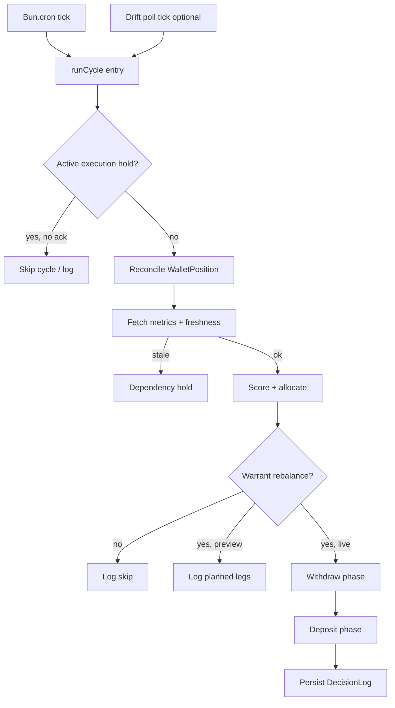

# Implementation Plan: Kamino Vault Yield Rebalancer

**Branch**: `001-vault-yield-rebalance` | **Date**: 2026-05-20 | **Spec**: [spec.md](./spec.md)  
**Input**: Feature specification + operator stack: Bun, TypeScript, `@solana/kit`, `@kamino-finance/klend-sdk`, Zod, Drizzle/SQLite, `Bun.cron`

## Summary

Build a long-running Bun daemon that periodically evaluates three Kamino Earn vaults, scores them on risk-adjusted yield, and rebalances the operator wallet via withdraw-then-deposit batches. Use **Solana Kit** for RPC/sign/send, **klend-sdk** `KaminoVault` for vault reads and `depositIxs`/`withdrawIxs`, **Zod** for config/domain validation, **Drizzle + SQLite** for decision logs and hold state, and **Bun.cron** for scheduling. Pin Kit 2.3.x to match klend-sdk 7.3.x transitive deps.

## Technical Context

**Language/Version**: TypeScript (ES modules), Bun ≥ 1.3  
**Primary Dependencies**:
- `@solana/kit` ^2.3.0 — RPC, addresses, signers, transaction pipeline ([anza-xyz/kit](https://github.com/anza-xyz/kit))
- `@kamino-finance/klend-sdk` ^7.3.22 — `KaminoVault`, metrics, deposit/withdraw ix ([klend-sdk](https://github.com/Kamino-Finance/klend-sdk))
- `zod` — config + boundary types
- `drizzle-orm` + `bun:sqlite` — persistence
- Kamino public API (optional) — historical metrics for backtest

**Storage**: SQLite at `data/bot.sqlite` (gitignored); Drizzle migrations under `drizzle/`  
**Testing**: `bun test`; unit in `tests/unit/`, integration in `tests/integration/` (`RUN_INTEGRATION_TESTS=true`)  
**Target Platform**: Linux/macOS server process (operator VPS or local)  
**Project Type**: Single-project CLI/daemon  
**Performance Goals**: ≥95% of cycles complete within 3-minute budget (SC-007); RPC calls bounded by 15s timeout  
**Constraints**:
- Exactly 3 vaults per instance (FR-001)
- No `@solana/web3.js` 1.x in app dependency tree
- Mainnet txs only when `PREVIEW_MODE=false` and not in hold
- Withdraw-then-deposit sequencing; no same-cycle retry after partial success

**Scale/Scope**: Single operator wallet; 15-minute cron default (`*/15 * * * *`); P1–P3 features per spec priority table

## Constitution Check

*GATE: Must pass before Phase 0 research. Re-checked after Phase 1 design.*

- [x] Logic in testable `src/` modules (not only entrypoint) — layered `config/`, `chain/`, `kamino/`, `strategy/`, `cycle/`, `db/`
- [x] Unit tests planned in `tests/unit/` — scoring, policy, Zod schemas, cycle state machine (mocked I/O)
- [x] Integration tests planned in `tests/integration/` — `KaminoVault` read paths, optional dry-run ix build; gated on `RUN_INTEGRATION_TESTS` + `SOLANA_RPC`
- [x] `README.md` updates when run/test/env change — required before merge (quickstart env vars, cron, DB, ack-hold CLI)
- [x] No secrets in repo; `.env` for keys and RPC
- [x] Bun toolchain only (`bun run format`, `bun run check`, `bun run test`, `bun run test:integration`)

**Post-design re-check**: All gates pass. No constitution exceptions required.

## Project Structure

### Documentation (this feature)

```text
specs/001-vault-yield-rebalance/
├── plan.md              # This file
├── research.md          # Phase 0
├── data-model.md        # Phase 1
├── quickstart.md        # Phase 1
├── contracts/           # Phase 1
│   ├── config.schema.json
│   ├── cycle-api.md
│   └── alerts.md
└── tasks.md             # Phase 2 (/speckit-tasks — not created here)
```

### Source Code (repository root)

```text
src/
├── index.ts                 # Bun.cron registration, process lifecycle
├── cli.ts                   # ack-hold, one-shot cycle, backtest entry
├── config/
│   ├── schema.ts            # Zod OperatorConfig, VaultConfig, Policy
│   └── load.ts              # env → validated config
├── chain/
│   ├── rpc.ts               # createSolanaRpc + timeout wrapper
│   ├── signer.ts            # keypair from PRIVATE_KEY
│   └── tx.ts                # sign, send, confirm, per-leg retry
├── kamino/
│   ├── vault.ts             # extend existing KaminoVault adapters
│   ├── metrics.ts           # snapshots + API supplement
│   └── reconcile.ts         # WalletPosition from chain
├── strategy/
│   ├── risk.ts              # RiskScore (FR-003, FR-017)
│   ├── allocate.ts          # targets (FR-004, FR-005)
│   └── warrant.ts           # should rebalance? (FR-006, FR-009)
├── cycle/
│   ├── runner.ts            # runCycle orchestrator
│   ├── execute.ts           # withdraw/deposit phases
│   ├── hold.ts              # dependency vs execution hold
│   └── drift-trigger.ts     # optional FR-013 poll → runCycle
├── db/
│   ├── schema.ts            # Drizzle tables
│   ├── client.ts            # sqlite connection
│   └── migrate.ts           # push/migrate helper
└── alerts/
    └── emit.ts              # structured alerts (contracts/alerts.md)

tests/
├── unit/
│   ├── config.test.ts
│   ├── risk.test.ts
│   ├── allocate.test.ts
│   ├── warrant.test.ts
│   ├── cycle-hold.test.ts
│   └── drift-trigger.test.ts
└── integration/
    ├── vault-read.test.ts
    └── deposit-ix-build.test.ts   # ix only, no send

data/                        # gitignored sqlite
drizzle/                     # migrations
```

**Structure Decision**: Extend existing single-project layout; migrate `config.ts` → `config/load.ts` + Zod schema; keep `vault.ts` API surface but move under `kamino/` (re-export for compatibility during implement).

## Complexity Tracking

> No violations. Table intentionally empty.

| Violation | Why Needed | Simpler Alternative Rejected Because |
|-----------|------------|-------------------------------------|

---

## Phase 0: Research

Completed in [research.md](./research.md). Key decisions:

| Topic | Decision |
|-------|----------|
| Solana client | `@solana/kit` 2.3.x only |
| Kamino SDK | `klend-sdk` 7.3.x `KaminoVault` |
| Version lock | Shared `Rpc`; `package.json` overrides for duplicate Kit minors |
| Validation | Zod at startup |
| Persistence | Drizzle + SQLite |
| Scheduler | `Bun.cron` + in-process mutex |
| Execution | `withdrawIxs` → send → `depositIxs` → send |

---

## Phase 1: Design

### Data model

See [data-model.md](./data-model.md).

### Contracts

| Artifact | Purpose |
|----------|---------|
| [contracts/config.schema.json](./contracts/config.schema.json) | Operator config shape (JSON Schema mirror of Zod) |
| [contracts/cycle-api.md](./contracts/cycle-api.md) | `runCycle`, reconcile, ack-hold, backtest |
| [contracts/alerts.md](./contracts/alerts.md) | Alert event catalog |

### Operator quickstart

See [quickstart.md](./quickstart.md).

### Dependency manifest (target `package.json` additions)

```json
{
  "dependencies": {
    "@kamino-finance/klend-sdk": "^7.3.22",
    "@solana/kit": "^2.3.0",
    "zod": "^3.24.0",
    "drizzle-orm": "^0.39.0"
  },
  "overrides": {
    "@kamino-finance/farms-sdk": "3.2.24",
    "@solana/kit": "2.3.0"
  }
}
```

Upgrade policy: bump klend-sdk only after verifying its peer `@solana/kit` range; run `bun pm ls` and integration tests.

### Cycle flow (implementation reference)



### Constitution Check (post-design)

All items remain satisfied. README update tracked for `/speckit-implement` phase.

---

## Phase 2: Implementation outline (for `/speckit-tasks`)

*Not executed by `/speckit-plan` — task breakdown belongs in `tasks.md`.*

Suggested epic order:

1. **Foundation** — Zod config, Drizzle schema, RPC/signer adapters, extend `kamino/vault.ts`
2. **Read path** — metrics ingestion, reconcile, integration tests
3. **Strategy** — risk, allocation, unit tests
4. **Guardrails** — warrant (`shouldRebalance`) before any live execution
5. **Execution** — withdraw/deposit phases, retries, partial/timeout handling (preview-safe until orchestrator)
6. **Cycle core** — `runCycle`, holds, timeouts, preview mode, decision logs
7. **Operations** — `Bun.cron`, drift trigger (FR-013), alerts, ack-hold CLI, README
8. **P3** — backtest mode, reserve concentration penalty tuning

---

## Risks & mitigations

| Risk | Mitigation |
|------|------------|
| Kit / klend-sdk version drift | Pin overrides; upgrade checklist in research.md |
| Partial withdraw/deposit | FR-011 reconcile-first; no same-cycle retry |
| RPC rate limits | Single shared Rpc; backoff; dependency hold |
| APY spikes / bad data | Volatility + trailing average guard; stale cutoff |
| Overlapping cron ticks | `cycleInFlight` mutex |

---

## Artifacts generated

| File | Status |
|------|--------|
| `specs/001-vault-yield-rebalance/plan.md` | ✅ This file |
| `specs/001-vault-yield-rebalance/research.md` | ✅ |
| `specs/001-vault-yield-rebalance/data-model.md` | ✅ |
| `specs/001-vault-yield-rebalance/quickstart.md` | ✅ |
| `specs/001-vault-yield-rebalance/contracts/*` | ✅ |
| `specs/001-vault-yield-rebalance/tasks.md` | ✅ |

**Next command**: `/speckit-implement` to execute dependency-ordered tasks.
